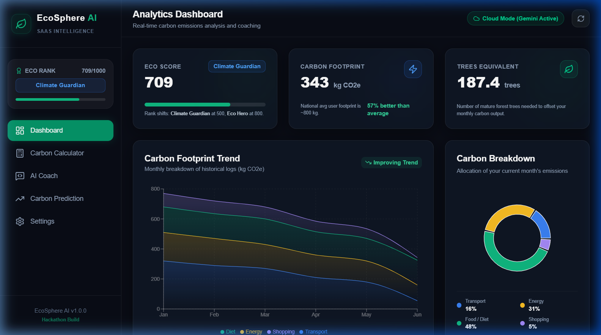
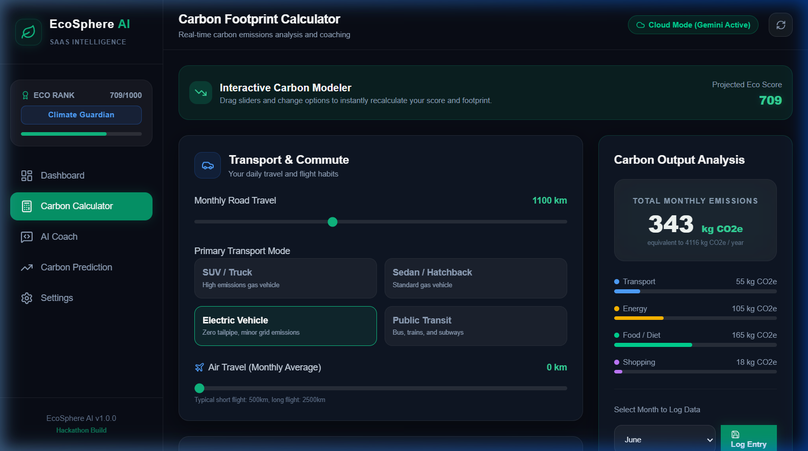
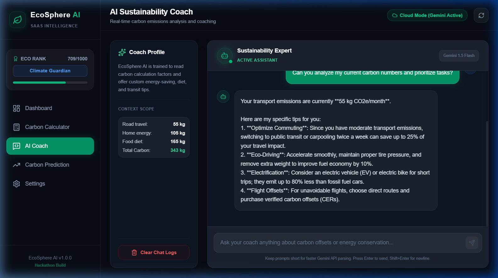
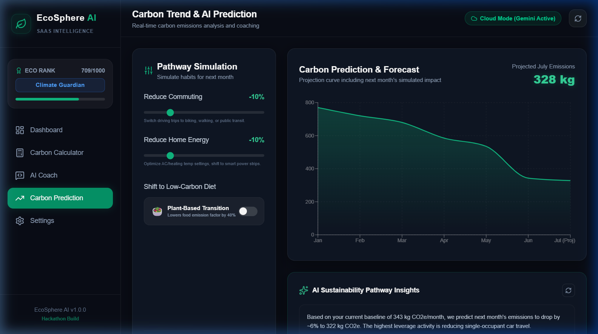
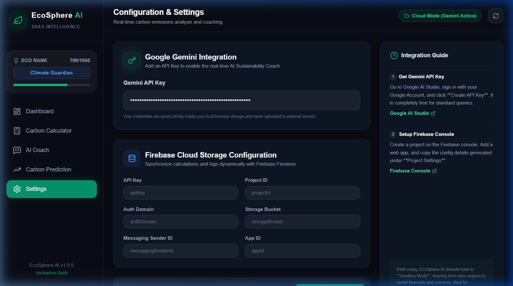
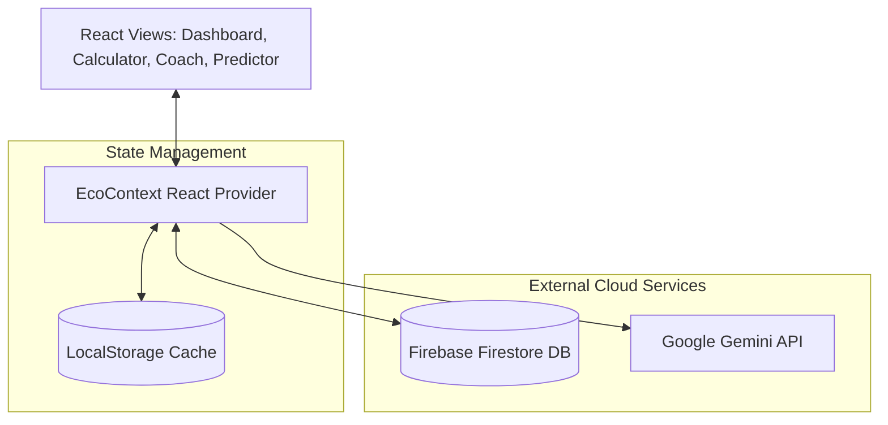

# 🌍 EcoSphere AI

> **Measure. Predict. Reduce. Save the Planet one action at a time.**

EcoSphere AI is an AI-powered Carbon Footprint Intelligence Platform designed to help individuals understand, track, predict, and reduce their environmental impact through intelligent insights, predictive analytics, and conversational AI coaching.

---

<p align="center">
  
</p>

<p align="center">
  
  
  
  
  
  
</p>

---

## 📖 Table of Contents

* [🎯 Problem Statement](#-problem-statement)
* [💡 Solution](#-solution)
* [🚀 Key Features](#-key-features)
* [📸 UI Walkthrough](#-ui-walkthrough)
* [🧬 System Architecture](#-system-architecture)
* [📊 Scientific Carbon Calculations](#-scientific-carbon-calculations)
* [🤖 AI Intelligence & Fallbacks](#-ai-intelligence--fallbacks)
* [🛠 Tech Stack](#-tech-stack)
* [📂 Project Structure](#-project-structure)
* [⚙️ Getting Started](#-getting-started)
* [🧪 Automated Testing](#-automated-testing)
* [🔮 Future Enhancements](#-future-enhancements)
* [📜 License](#-license)

---

## 🎯 Problem Statement

Climate change is the defining crisis of our time, yet individuals often find it difficult to understand how their daily actions translate to greenhouse gas emissions. Traditional carbon calculators are static, dry, and offer generic advice that fails to drive long-term behavioral change. There is a critical gap in tools that combine **real-time calculations, predictive trends, actionable daily habits, and interactive personalized guidance** under a unified, engaging user interface.

---

## 💡 Solution

**EcoSphere AI** bridges this gap by turning sustainability into a personalized, gamified, and AI-driven journey. The platform enables users to:
1. **Quantify** monthly impact across transport, energy, food, and consumption.
2. **Forecast** long-term trends using trend-based historical forecasting.
3. **Engage** in carbon reductions through a daily habits checklist and real-time Eco Score.
4. **Consult** a dedicated AI Coach backed by Google Gemini for tailored carbon-reduction roadmaps.

---

## 🚀 Key Features

*   **📊 Multi-Sector Carbon Calculator:** Real-time impact analyzer assessing road transit, flights, household power usage, eating habits, and shopping expenditures.
*   **🤖 AI Sustainability Coach:** Google Gemini integration providing custom contextual recommendations and smart conversational planning.
*   **🏆 Dynamic Eco Score & Ranks:** Gamified status engine awarding titles from *Green Citizen* to *Climate Guardian* and *Eco Hero* based on footprint size and completed eco-habits.
*   **📈 Prediction & Trend Dashboard:** Multi-month historical tracking and forecasting displaying carbon projection lines for proactive reduction.
*   **🌳 Environmental Offset Translation:** Converts raw metric tons of carbon into visual equivalencies, such as the equivalent number of adult trees required to offset emissions.
*   **🔌 Dual Connection Architecture:** Supports an offline-first **Sandbox Mode** (relying on LocalStorage and local rule-based models) and a **Cloud Mode** (synced with Firebase Firestore).

---

## 📸 UI Walkthrough

### 1. Unified Analytics Dashboard
The core control panel presents an immediate overview of the user's environmental metrics. It visualizes the current carbon breakdown using high-performance charts, displays the tree offset equivalency, and lists daily habits to build sustainability momentum.
<p align="center">
  
</p>

### 2. Live Carbon Calculator
An interactive form utilizing smooth slider animations to allow dynamic updates. Modifications instantly recompute carbon metrics, update the Eco Score, and adjust the local/cloud states.
<p align="center">
  
</p>

### 3. AI Sustainability Coach
A chat console powered by Google Gemini. It reviews the user's specific calculator outputs to deliver hyper-targeted advice on home optimization, dietary changes, and transit options.
<p align="center">
  
</p>

### 4. Forecasting & Prediction Dashboard
Integrates historical monthly logs with predictive analytics, charting previous performance and projecting next month's anticipated carbon footprint based on behavioral habits.
<p align="center">
  
</p>

### 5. Multi-Mode Settings Manager
Allows seamless swapping between localized sandbox simulations and full-fledged cloud synchronization by adding Google Gemini API keys and Firebase Configuration payloads.
<p align="center">
  
</p>

---

## 🧬 System Architecture

EcoSphere AI is structured as an interactive React SPA with centralized state synchronization. The diagram below illustrates how values flow between the views, contexts, local storage, external Firebase databases, and Gemini AI:



---

## 📊 Scientific Carbon Calculations

To ensure analytical credibility, EcoSphere AI uses standardized emission factors (derived from EPA and greenhouse gas reporting guidelines) converted to monthly impact values:

### 1. Transportation Carbon Footprint
Emissions are calculated based on the monthly vehicle type and flight distances:
$$\text{Emissions}_{\text{transport}} = (D_{\text{road}} \times F_{\text{vehicle}}) + (D_{\text{flight}} \times F_{\text{flight}})$$

Where:
*   $D_{\text{road}}$ is road travel distance in km/month.
*   $D_{\text{flight}}$ is air travel distance in km/month.
*   $F_{\text{vehicle}}$ factors represent:
    *   `SUV`: $0.25$ kg $CO_2e/\text{km}$
    *   `Sedan`: $0.17$ kg $CO_2e/\text{km}$
    *   `EV` (Electric Vehicle): $0.05$ kg $CO_2e/\text{km}$ *(representing charging grid average)*
    *   `Transit` (Public/Bus/Train): $0.04$ kg $CO_2e/\text{km}$
*   $F_{\text{flight}}$ factor is $0.15$ kg $CO_2e/\text{km}$.

### 2. Electricity Carbon Footprint
Household energy is calculated directly from electricity consumption:
$$\text{Emissions}_{\text{electricity}} = E_{\text{kWh}} \times 0.475 \text{ kg } CO_2e/\text{kWh}$$

### 3. Diet Carbon Footprint
Monthly dietary impact represents a 30-day baseline for the dietary category:
$$\text{Emissions}_{\text{food}} = F_{\text{diet}} \times 30$$

Where $F_{\text{diet}}$ represents daily emissions factors:
*   `Vegan`: $2.0$ kg $CO_2e/\text{day}$
*   `Vegetarian`: $3.5$ kg $CO_2e/\text{day}$
*   `Balanced`: $5.5$ kg $CO_2e/\text{day}$
*   `High Meat`: $8.0$ kg $CO_2e/\text{day}$

### 4. Shopping Carbon Footprint
Consumer spend carbon impact is calculated based on dollars spent:
$$\text{Emissions}_{\text{shopping}} = S_{\$} \times 0.12 \text{ kg } CO_2e/\$$$

### 5. Eco Score Formula
The platform uses a gamified credit system ranging from **50 (critical impact)** to **1000 (perfect status)**:
$$\text{Eco Score} = \max\left(50, \min\left(1000, 850 - (\text{Total Carbon Emissions} \times 0.5) + \text{Completed Habit Points}\right)\right)$$

### 6. Tree Offset Translation
We convert carbon footprint totals into tree absorption numbers:
$$\text{Trees Needed} = \frac{\text{Total Emissions}}{1.83}$$
*(Based on the scientific baseline that an average mature adult tree absorbs approximately 22kg of $CO_2$ per year, which equates to $1.83$ kg of $CO_2$ per month)*

---

## 🤖 AI Intelligence & Fallbacks

EcoSphere AI uses a multi-tier logic architecture to ensure reliability and responsiveness under all deployment situations:

```
                  ┌───────────────────────────────┐
                  │      User Triggers Inquiry    │
                  └───────────────┬───────────────┘
                                  │
                   Is Gemini API Key configured?
                   isApiKeyActive?
                   /             \
                 YES              NO
                 /                 \
  ┌────────────────────────┐   ┌──────────────────────────────┐
  │ Query Gemini model     │   │ Run Local Rule-Based Advisor │
  │ "gemini-2.5-flash"     │   │ Engine (Emissions-Aware)     │
  └────────────────────────┘   └──────────────────────────────┘
```

1.  **AI Cloud Mode:** If a Gemini API Key is configured in the settings dashboard, the app initiates `GoogleGenerativeAI` targeting the `gemini-2.5-flash` model. It injects the user's specific emissions dataset and queries the conversational agent for responses.
2.  **Sandbox Mode Fallback:** If no API key is specified, the application defaults to a built-in rules engine. This offline engine analyzes user variables (such as checking if Transport is the highest emission sector) to simulate natural-sounding, highly helpful carbon reduction strategies and monthly trend projections with zero network overhead.

---

## 🛠 Tech Stack

*   **Frontend Core:** React 19 (Hooks, Context), Vite (Asset Bundler, Dev Server), Tailwind CSS v4.
*   **AI Integration:** `@google/generative-ai` SDK.
*   **Charts & Visualizations:** `recharts` for scalable SVG charting.
*   **Iconography & Design:** `lucide-react` icons, custom glassmorphism stylesheet parameters, and standard Google Fonts integration (Inter).
*   **Testing Suite:** `Vitest` and `@testing-library/react` running on `jsdom`.

---

## 📂 Project Structure

```text
EcoSphere-AI/
│
├── public/                 # Static assets (Favicons, SVG asset maps)
│   └── screenshots/        # High-resolution screenshots showcased in README.md
│
├── src/
│   ├── assets/             # Raw static graphics (Hero banners, system vectors)
│   ├── components/         # Shared presentation elements
│   │   ├── glass-card.jsx  # Styled glassmorphic container layout
│   │   ├── header.jsx      # Top dynamic page navbar
│   │   └── sidebar.jsx     # Navigation control panel featuring Eco Score badge
│   │
│   ├── context/            # Centralized state management
│   │   ├── EcoContext.jsx  # Main state provider containing formulas & presets
│   │   └── EcoContext.test.jsx
│   │
│   ├── services/           # External API integrations
│   │   ├── firebase.js     # Initialization logic for Firestore Cloud Storage
│   │   └── gemini.js       # Integrates Gemini AI client and fallback engines
│   │
│   ├── views/              # View screens
│   │   ├── calculator.jsx  # Interactive Carbon footprint input form
│   │   ├── calculator.test.jsx
│   │   ├── coach.jsx       # Conversational AI coach container
│   │   ├── dashboard.jsx   # Core overview dashboard
│   │   ├── predictor.jsx   # Forecasting & historical graphs screen
│   │   └── settings.jsx    # Config credentials screen
│   │
│   ├── App.css             # Main styling classes
│   ├── App.jsx             # Top level layout & drawer triggers
│   ├── index.css           # Global Tailwind directive styles
│   └── main.jsx            # DOM compiler anchor
│
├── package.json            # Scripts, workspace parameters, and version list
├── tailwind.config.js      # Styling overrides and colors
├── vite.config.js          # Vite configuration
└── postcss.config.js       # CSS processor configuration
```

---

## ⚙️ Getting Started

### 1. Prerequisites
Ensure you have Node.js installed on your computer.

```bash
node --version
# Recommended: Node.js 18.x or 20.x +
```

### 2. Clone the Repository
```bash
git clone <repository-url>
cd EcoSphere-AI
```

### 3. Install Dependencies
```bash
npm install
```

### 4. Running the Development Server
```bash
npm run dev
```
Open [http://localhost:5173](http://localhost:5173) in your browser.

### 5. Compiling for Production
```bash
npm run build
# The optimized output is written to the `/dist` directory
```

---

## 🧪 Automated Testing

We maintain a suite of unit and integration tests built on **Vitest** to ensure calculator arithmetic, context updates, and view events are functional and bug-free.

### Run Tests
```bash
npm run test
```

---

## 🔮 Future Enhancements

*   **📷 Smart Utility Bill Reader (OCR):** Enable users to upload energy bills, parse usage data with Gemini Multimodal capabilities, and fill calculations automatically.
*   **🌱 Verified Offset Shop:** Integration with carbon-offset registries (e.g. Gold Standard) to offset emissions with verified credits directly.
*   **👥 Leaderboards & Peer Challenges:** Social features to share score milestones and complete green challenges with peers.
*   **🔌 IoT Smart-Home Integrations:** Real-time electricity tracker connections (e.g. Sense, Nest) for active emissions reporting.

---

## 📜 License

This project is developed for educational, open-source demonstration, and hackathon evaluation purposes. All carbon computations are estimates and should not be used as official compliance auditing reports.

---

<p align="center">
  Built with 💚 to promote carbon awareness and sustainability.
</p>
